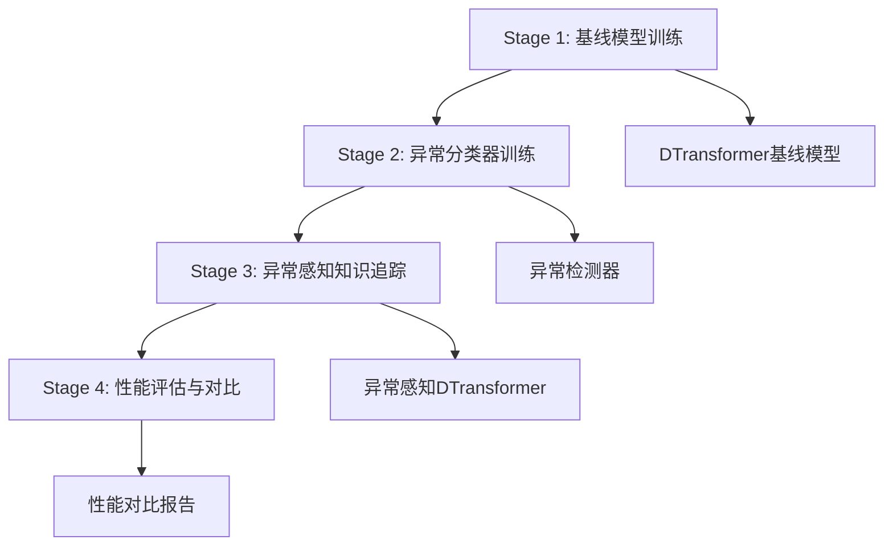

# 项目总览：Anomaly-Aware Knowledge Tracing v2

## 🎯 项目目标

通过异常检测技术增强知识追踪模型的性能，实现更准确的学习状态预测和个性化学习路径推荐。

## 🏗️ 整体架构

### 四阶段训练流程



### 技术栈

- **深度学习框架**: PyTorch
- **模型架构**: Transformer (DTransformer)
- **异常检测**: 基于课程学习的异常分类器
- **数据处理**: 序列化学习行为数据
- **评估指标**: AUC, ACC, F1, Precision, Recall

## 📊 当前进度

### ✅ 已完成 (Stage 1)

1. **项目重构**
   - 清理代码结构
   - 模块化设计
   - 配置系统重构

2. **基线模型训练**
   - DTransformer模型实现
   - 自动配置系统
   - 训练脚本和文档
   - 单元测试

3. **验证结果**
   - ASSIST17数据集: AUC 0.74-0.76
   - 训练稳定性验证
   - 参数一致性确认

### 🚧 进行中 (Stage 2)

1. **异常分类器设计**
   - 课程学习框架
   - 异常生成策略
   - 难度估计算法

2. **待解决问题**
   - 数据格式兼容性
   - 模型参数匹配
   - 训练流程优化

### 📋 计划中 (Stage 3-4)

1. **异常感知知识追踪**
   - 融合异常信息的DTransformer
   - 端到端训练流程
   - 性能优化

2. **评估与对比**
   - 全面性能评估
   - 消融研究
   - 结果分析报告

## 🔧 技术特点

### 1. 模块化设计

```
anomaly_kt_v2/
├── configs/          # 配置管理
├── core/            # 核心工具
├── stages/          # 训练阶段
├── scripts/         # 执行脚本
├── tests/           # 单元测试
└── docs2/           # 项目文档
```

### 2. 灵活配置系统

- **多层次配置**: 命令行 > 配置文件 > 默认值
- **自动配置**: 根据数据集自动选择最佳参数
- **实验管理**: 完整的实验记录和重现机制

### 3. 渐进式训练策略

- **Stage 1**: 建立性能基线
- **Stage 2**: 学习异常模式
- **Stage 3**: 融合异常信息
- **Stage 4**: 验证性能提升

## 📈 预期成果

### 性能提升目标

| 数据集 | 基线AUC | 目标AUC | 预期提升 |
|--------|---------|---------|----------|
| ASSIST09 | 0.82-0.85 | 0.85-0.88 | 3-5% |
| ASSIST17 | 0.74-0.76 | 0.78-0.82 | 5-8% |

### 技术贡献

1. **异常感知知识追踪**: 首次将异常检测系统性地应用于知识追踪
2. **课程学习框架**: 渐进式异常检测训练策略
3. **端到端训练**: 完整的异常感知知识追踪训练流程

## 🔬 研究价值

### 学术价值

1. **方法创新**: 异常检测与知识追踪的深度融合
2. **理论贡献**: 学习行为异常的系统性分析
3. **实验验证**: 多数据集的全面验证

### 应用价值

1. **教育技术**: 提升在线学习平台的预测准确性
2. **个性化学习**: 更精准的学习路径推荐
3. **学习分析**: 深入理解学习行为模式

## 🛠️ 开发规范

### 代码质量

- **模块化**: 清晰的模块边界和接口
- **文档化**: 完整的代码注释和API文档
- **测试覆盖**: 全面的单元测试和集成测试
- **版本控制**: 规范的Git提交和分支管理

### 实验管理

- **可重现性**: 完整的配置记录和随机种子控制
- **版本追踪**: 实验版本和结果的系统性记录
- **性能监控**: 实时的训练监控和异常检测

## 📚 相关工作

### 知识追踪领域

1. **DKT (Deep Knowledge Tracing)**: 基础的深度学习知识追踪
2. **DKVMN**: 动态键值记忆网络
3. **SAKT**: 自注意力知识追踪
4. **DTransformer**: 基于Transformer的知识追踪

### 异常检测领域

1. **时序异常检测**: 基于LSTM/GRU的序列异常检测
2. **Transformer异常检测**: 基于注意力机制的异常检测
3. **课程学习**: 渐进式训练策略

## 🔮 未来方向

### 短期目标 (3-6个月)

1. **完成四阶段训练**: 实现完整的训练流程
2. **性能验证**: 在多个数据集上验证性能提升
3. **代码开源**: 发布完整的开源代码和文档

### 中期目标 (6-12个月)

1. **方法扩展**: 支持更多类型的学习行为异常
2. **模型优化**: 提升训练效率和预测精度
3. **应用部署**: 在实际教育平台上部署验证

### 长期目标 (1-2年)

1. **理论深化**: 深入研究异常检测的理论基础
2. **跨域应用**: 扩展到其他序列预测任务
3. **产业化**: 形成可商业化的技术方案

## 📞 联系方式

- **项目负责人**: [研究团队]
- **技术支持**: [技术邮箱]
- **项目主页**: [GitHub链接]

## 📄 许可证

本项目采用MIT许可证，支持学术研究和商业应用。

---

*最后更新: 2024年1月*
