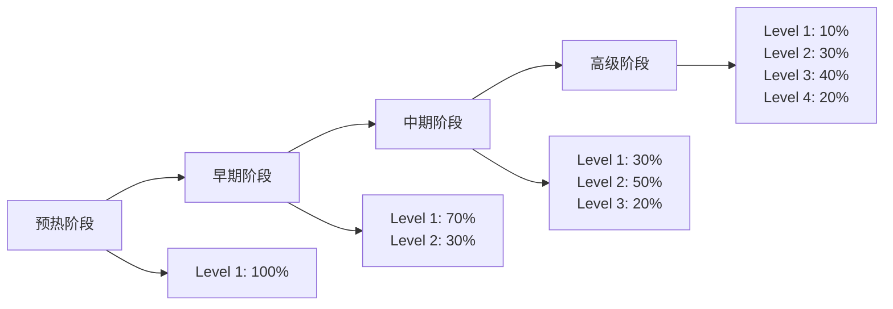

# 第二阶段详细指南：异常分类器训练

## 📋 概述

第二阶段专注于训练基于课程学习的异常分类器，用于检测学习行为序列中的异常模式。该阶段是异常感知知识追踪系统的核心组件。

## 🎯 训练目标

1. **异常检测能力**: 准确识别学习序列中的异常行为
2. **课程学习**: 从简单到复杂的渐进式训练
3. **因果性保证**: 严格遵守时序因果关系
4. **泛化能力**: 在不同类型异常上的鲁棒性能

## 🏗️ 技术架构

### 核心组件

#### 1. 因果异常检测器 (`CausalAnomalyDetector`)
- **基于Transformer**: 利用自注意力机制捕获序列依赖
- **因果掩码**: 确保只使用历史信息进行预测
- **统计特征**: 结合窗口统计特征增强检测能力
- **多层架构**: 可配置的Transformer层数

#### 2. 课程学习系统
- **4级难度体系**: 从简单到极难的异常分类
- **渐进式调度**: 动态调整训练难度
- **自适应权重**: 根据模型性能调整难度分布

#### 3. 异常生成器
- **基线生成器**: 用于技术验证的简单异常
- **课程生成器**: 教育价值高的复杂异常模式

## 📊 课程学习体系

### 难度级别设计

| 级别 | 名称 | 异常特征 | 检测难度 | 教育价值 | 示例策略 |
|------|------|----------|----------|----------|----------|
| **Level 1** | 简单异常 | 明显可检测 | 低 | 中 | 连续错误、简单随机 |
| **Level 2** | 中等异常 | 需要模式识别 | 中 | 高 | 周期性异常、突发错误 |
| **Level 3** | 困难异常 | 微妙时序异常 | 高 | 高 | 能力不匹配、渐进变化 |
| **Level 4** | 极难异常 | 高级欺骗性 | 极高 | 极高 | 智能掩蔽、欺骗模式 |

### 训练阶段



## ⚙️ 配置参数详解

### 基本参数

```yaml
# 数据集和设备配置
dataset: assist17              # 数据集名称
device: cuda                   # 训练设备
baseline_model_path: "..."     # 第一阶段模型路径
```

### 异常检测器参数

```yaml
# 模型架构（自动从基线模型继承）
d_model: 256                   # 模型维度
n_heads: 16                    # 注意力头数
n_layers: 2                    # 检测器层数（比基线少）
dropout: 0.1                   # Dropout率
window_size: 10                # 统计特征窗口
```

### 课程学习参数

```yaml
# 训练配置
anomaly_epochs: 50             # 训练轮数
learning_rate: 0.001           # 学习率
patience: 10                   # 早停耐心值

# 课程调度
curriculum_type: linear        # 调度类型
initial_difficulty: 0.1        # 初始难度
final_difficulty: 0.8          # 最终难度
warmup_epochs: 5               # 预热轮数
```

## 🚀 使用指南

### 基础使用

#### 1. 基础模型的异常分类器

```bash
python scripts/run_stage2_anomaly_classifier.py \
    --dataset assist17 \
    --model_type basic \
    --baseline_model_path output/stage1_basic_assist17_*/baseline/best_model.pt \
    --auto_config \
    --device cuda
```

#### 2. 扩展模型的异常分类器

```bash
python scripts/run_stage2_anomaly_classifier.py \
    --dataset assist17 \
    --model_type extended \
    --baseline_model_path output/stage1_extended_assist17_*/baseline/best_model.pt \
    --auto_config \
    --device cuda
```

### 高级配置

#### 自定义课程学习

```bash
python scripts/run_stage2_anomaly_classifier.py \
    --dataset assist17 \
    --model_type basic \
    --baseline_model_path "..." \
    --anomaly_epochs 100 \
    --curriculum_type exponential \
    --initial_difficulty 0.05 \
    --final_difficulty 0.9 \
    --warmup_epochs 10 \
    --device cuda
```

#### 调试模式

```bash
python scripts/run_stage2_anomaly_classifier.py \
    --dataset assist17 \
    --model_type basic \
    --baseline_model_path "..." \
    --anomaly_epochs 5 \
    --batch_size 4 \
    --device cpu
```

## 📈 性能评估

### 评估指标

1. **AUC (Area Under Curve)**: 主要评估指标
2. **PR-AUC (Precision-Recall AUC)**: 不平衡数据集的补充指标
3. **F1-Score**: 精确率和召回率的调和平均
4. **分层性能**: 不同难度级别的检测性能

### 评估策略

系统会自动在多种异常策略上评估模型：

- **随机翻转**: 基础检测能力验证
- **均匀随机**: 最简单的异常模式
- **系统偏差**: 中等难度的模式异常
- **高斯噪声**: 噪声鲁棒性测试

### 预期性能

| 模型类型 | 目标AUC | 随机翻转AUC | 系统偏差AUC | 训练时间 |
|----------|---------|-------------|-------------|----------|
| **基础模型** | 0.75-0.80 | 0.80+ | 0.70+ | 20-25分钟 |
| **扩展模型** | 0.80-0.85 | 0.85+ | 0.75+ | 30-40分钟 |

## 📁 输出结构

```
output/stage2_basic_assist17_20240101_120000/
├── config.yaml                    # 训练配置
├── anomaly_classifier/             # 异常分类器目录
│   ├── best_anomaly_detector.pt   # 最佳模型
│   ├── training_log.txt           # 训练日志
│   └── evaluation_report.txt      # 评估报告
└── plots/                         # 可视化图表
    ├── curriculum_progress.png    # 课程学习进度
    ├── difficulty_distribution.png # 难度分布
    └── performance_curves.png     # 性能曲线
```

## 🔧 调优建议

### 性能优化

1. **模型容量调整**
   ```bash
   # 增加检测器层数
   --n_layers 3
   
   # 调整窗口大小
   --window_size 15
   ```

2. **课程学习调优**
   ```bash
   # 更长的预热期
   --warmup_epochs 10
   
   # 更激进的难度增长
   --curriculum_type exponential
   ```

3. **训练策略**
   ```bash
   # 更多训练轮数
   --anomaly_epochs 100
   
   # 调整学习率
   --learning_rate 0.0005
   ```

### 常见问题解决

#### 1. 检测性能不佳
- 增加模型容量 (`--n_layers`, `--window_size`)
- 延长训练时间 (`--anomaly_epochs`)
- 调整课程学习策略

#### 2. 训练不稳定
- 降低学习率 (`--learning_rate 0.0005`)
- 增加预热轮数 (`--warmup_epochs`)
- 使用线性调度 (`--curriculum_type linear`)

#### 3. 内存不足
- 减少批次大小 (`--batch_size 8`)
- 降低模型维度
- 使用CPU训练

## 🔬 实验建议

### 消融研究

1. **课程学习效果**
   ```bash
   # 有课程学习
   --curriculum_type linear
   
   # 无课程学习（固定难度）
   --initial_difficulty 0.5 --final_difficulty 0.5
   ```

2. **难度级别影响**
   ```bash
   # 只使用简单异常
   --final_difficulty 0.3
   
   # 包含所有难度
   --final_difficulty 0.8
   ```

3. **模型架构影响**
   ```bash
   # 浅层模型
   --n_layers 1
   
   # 深层模型
   --n_layers 4
   ```

### 对比实验

建议同时训练基础模型和扩展模型的异常分类器，进行性能对比：

```bash
# 基础模型异常分类器
python scripts/run_stage2_anomaly_classifier.py \
    --dataset assist17 --model_type basic \
    --baseline_model_path "基础模型路径" \
    --auto_config --device cuda

# 扩展模型异常分类器  
python scripts/run_stage2_anomaly_classifier.py \
    --dataset assist17 --model_type extended \
    --baseline_model_path "扩展模型路径" \
    --auto_config --device cuda
```

## 📊 监控和调试

### 训练监控

训练过程中会实时显示：
- 当前课程状态（难度、阶段）
- 训练损失和AUC
- 验证性能
- 早停状态

### 日志分析

```bash
# 查看训练日志
tail -f output/stage2_*/anomaly_classifier/training_log.txt

# 查看评估报告
cat output/stage2_*/anomaly_classifier/evaluation_report.txt
```

## 🔄 与其他阶段的衔接

### 输入依赖
- **第一阶段输出**: 基线模型权重和配置
- **数据集**: 与第一阶段相同的数据集

### 输出产物
- **异常检测器**: 用于第三阶段的异常感知知识追踪
- **评估报告**: 异常检测性能基准
- **训练配置**: 可重现的实验设置

### 第三阶段准备

第二阶段完成后，可以进入第三阶段：

```bash
python scripts/run_stage3_anomaly_aware_kt.py \
    --dataset assist17 \
    --model_type basic \
    --baseline_model_path "第一阶段模型路径" \
    --anomaly_detector_path "第二阶段检测器路径" \
    --device cuda
```

这个第二阶段为整个异常感知知识追踪系统提供了核心的异常检测能力，是连接基线训练和最终异常感知模型的关键桥梁。
